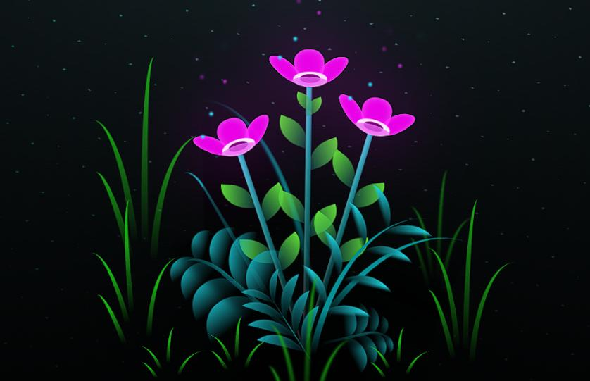

# 🌼 Flores Moradas
 – Proyecto Web Creativo


Este proyecto forma parte de una entrega académica/creativa en la que se explora el desarrollo de una experiencia web basada en el concepto de las “flores Moradas
”, un símbolo cultural popular que representa el amor, la esperanza y los pequeños detalles.

---

## ✨ Descripción

**Flores Moradas
** es una página web desarrollada con tecnologías web básicas. Tiene como objetivo brindar una experiencia visual atractiva, posiblemente con animaciones, interacciones o mensajes personalizados.

Ideal para celebraciones, detalles digitales o actividades académicas relacionadas con el desarrollo frontend.

---

## 🛠️ Tecnologías utilizadas

- **HTML5**
- **CSS3**
- **JavaScript**
- (Opcional: se puede incluir librerías o efectos visuales)

---

## 🚀 ¿Cómo usar el proyecto?

1. Clona el repositorio o descarga el ZIP.

   ```bash
   git clone https://github.com/tu-usuario/Florez_Moradas
   .git
   cd Florez_Moradas
   
   ```

2. Abre el archivo `index.html` con tu navegador.

   ¡Y listo! Ya puedes disfrutar del proyecto.

---

## 🌐 Despliegue en GitHub Pages

🔗 **Tu sitio está en línea en:**  
[[https://santiagons2.github.io/Florez_Moradas](https://santiagons2.github.io/Florez_Moradas/flower.html)
/]
/)  

_Last deployed by @santiagoNS2_

1. Asegúrate de que el archivo `index.html` esté en la raíz del proyecto.
2. Ve a **Settings > Pages**.
3. En "Source", selecciona:
   - **Branch:** `main`
   - **Folder:** `/ (root)`
4. Guarda los cambios y accede al enlace anterior.

---

## 📸 Captura de pantalla

*(Agrega aquí una imagen si tienes, como `flores.jpg`)*

```markdown

```

---

## 📚 Créditos

Desarrollado por @santiagoNS2  
Proyecto creativo / académico – 2024

---

## 💛 Notas

- Ideal para enviar como detalle visual en celebraciones especiales.
- Puede adaptarse fácilmente para incluir nombres, canciones, poemas o animaciones.
